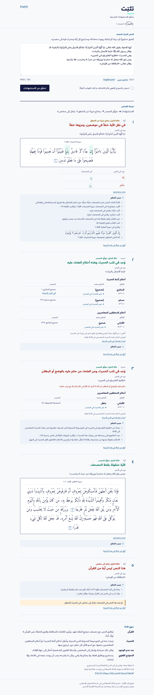
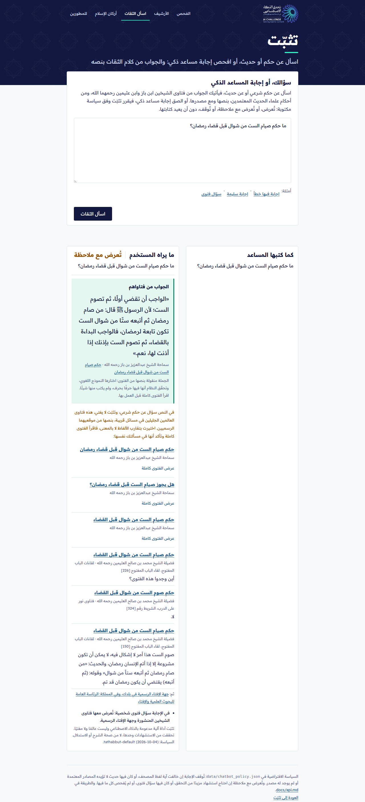
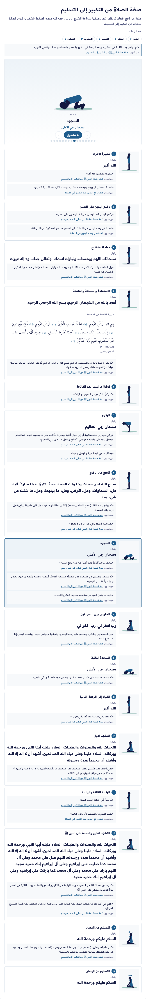
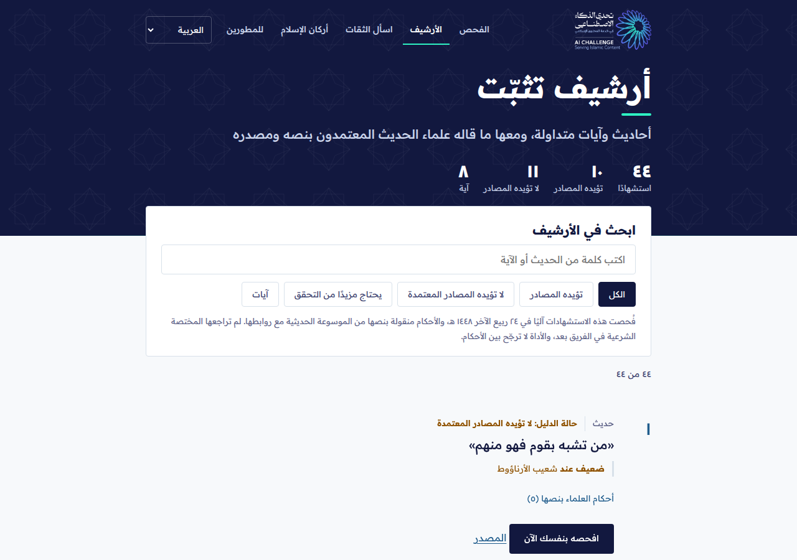

# تثبّت · Tathabbut

**مدقق ذكي متعدد اللغات للاستشهادات الشرعية.** فريق «قيد الأوابد»، مسار أدوات المعرفة والتحقق لتمكين المعرّفين بالإسلام، تحدي الذكاء الاصطناعي في خدمة المحتوى الإسلامي (مؤسسة باذل الأهلية، 2026).

يلصق المعرّف بالإسلام أو صانع المحتوى منشورًا أو درسًا أو إجابة روبوت محادثة، فيستخرج تثبّت كل آية وحديث، ويتتبع كل واحد إلى مصدره العربي:
- **الآيات** تُطابق مع نص مصحف مجمع الملك فهد، فيظهر موضعها، والكلمات المخالفة إن نُقلت بخطأ، وخطأ العزو إن كُتب رقم سورة أو آية غير صحيح. نص القرآن لا يُولَّد أبدًا.
- **الأحاديث** يُبحث عنها في الموسوعة الحديثية للدرر السنية، وتُعرض أحكام علماء الحديث المعتمدين حرفيًا مع اسم قائل كل حكم: أحكام أئمة الحديث أولًا ثم أحكام المحققين المعاصرين، كلٌّ مرتب بسنة الوفاة، دون ترجيح آلي.
- **إن لم يجد** قال ذلك صراحة وأحال إلى المختص. وفي أسئلة الفتوى الشخصية تدلّ على فتاوى الشيخين عبدالعزيز بن باز ومحمد بن صالح العثيمين رحمهما الله في موقعيهما الرسميين، فإن لم يوجد فيها ما يستوفي الحالة فإلى جهة الإفتاء الرسمية (وفي المملكة: الرئاسة العامة للبحوث العلمية والإفتاء). وتعرض الأداة فتاوى الشيخين المنشورة في المسائل القريبة بنصها كما في موقعيهما مع مصدرها ورابطها: تجدها ببحث الموقعين نفسيهما وترتبها بتقارب الألفاظ، ولا يكتب النموذج اللغوي منها حرفًا ولا يختارها. فتاوى ابن باز كاملة (الموقع يتيح النقل بشرط ذكر المصدر)، وفتاوى ابن عثيمين سؤالها وأول جوابها ورابطها (الحقوق محفوظة لمؤسسة الشيخ).

النموذج اللغوي (علّام من سدايا، ونموذج سريع مفتوح احتياطيًا) يستخرج ويطابق فقط، ولا يُصدر حكمًا ولا فتوى. وكل استشهاد يقترحه يجب أن يوجد حرفيًا في نص المستخدم وإلا يُحذف، وكل جملة ينقلها من فتوى يجب أن توجد فيها حرفًا بحرف وإلا لا تُعرض.

**أقسام الموقع** · https://3rb-tathabbut.hf.space

| القسم | ما فيه |
|---|---|
| **الفحص** | الصق نصًا، فتُستخرج آياته وأحاديثه وتُتتبع إلى مصادرها، مع حالة الدليل وسبب الحكم |
| **اسأل الثقات** | اسأل عن حكم أو حديث بأي صياغة، بالعامية أو بغير العربية، فيأتيك الجواب من فتاوى ابن باز وابن عثيمين بنصها، أو الصق إجابة مساعد ذكي فيقرر: تُعرض، أو تُعرض مع ملاحظة، أو تُوقف |
| **الأرشيف** | استشهادات متداولة فحصتها الأداة، مع أحكام العلماء بنصها |
| **الأذكار الموثّقة** | أذكار الصباح والمساء والصلاة والنوم، والأدعية والرقية، كل ذكر منها فحصه تثبّت: لا يُعرض إلا على رواية فيها لفظه كاملًا بحكم مقبول من العلماء المعتمدين، وفي وقته إن ذكرته الرواية، وبعدده إن نصّت عليه. ومعها المصحف (تجريبي)، ومتابعة العبادات، وأسماء الله الحسنى بآياتها، والتسبيح، وآية اليوم |
| **أركان الإسلام** | الأركان الخمسة، والوضوء والصلاة خطوة خطوة برسوم متحركة، بكلام الشيخ ابن باز بنصه، ولغير العرب |
| **للمطورين** | الواجهة البرمجية (`/docs`) وخادم MCP لوكلاء الذكاء الاصطناعي (`/mcp`) |

بإحدى عشرة لغة: العربية، والإنجليزية، والأردية، والإندونيسية، والبنغالية، والتركية، والفرنسية، والإسبانية، والهندية، والصينية، واليابانية. المصدر يبقى عربيًا: الآية بترجمة معتمدة لمعانيها، وكلام العلماء والحديث لا يُترجمان آليًا.



| اسأل الثقات | أركان الإسلام | الأرشيف |
|---|---|---|
|  |  |  |

لقطات من 5 أكتوبر 2026، والنتائج فيها من الموقع المباشر.

### حالة الدليل لكل استشهاد

| الحالة | معناها |
|---|---|
| **مطابق للمصحف** | آية مطابقة لنص المصحف في موضعها |
| **تؤيده المصادر** | حديث في الصحيحين، أو كل أحكام العلماء المعتمدين على لفظه في المقبول |
| **لا تؤيده المصادر المعتمدة** | كل أحكام المعتمدين على لفظه ضعيف أو موضوع (والأحمر للموضوع وحده) |
| **يحتاج مزيدًا من التحقق** | لفظ مختلف، أو عزو خطأ، أو لفظ مقارب، أو اختلاف الأحكام |
| **يُحال إلى مختص** | لم يوجد في المصدر، أو سؤال فتوى شخصية |

قواعد حالة الحديث في `data/display_rules.json`، تطبقها الأداة آليًا دون ترجيح بين العلماء، وتكتبها المختصة الشرعية في الفريق وتوقّعها (مسودة الفريق حتى توقيعها، والواجهة تقول ذلك).

وتحت كل استشهاد «سبب الحكم»: كيف عرفت الأداة ما قالته، ورابط المصدر، وزر «أبلغ عن خطأ في هذه النتيجة».

## ما بُني في أيام التحدي · Built during the challenge (4 to 6 Oct)

نقطة البداية `1bc66fb` ([STARTING_VERSION.md](STARTING_VERSION.md))، وكل تغيير بعدها في [CHANGELOG.md](CHANGELOG.md)، وقرارات الفريق في [docs/team.md](docs/team.md).

| تم | باقٍ |
|---|---|
| التحقق الحي من الدرر السنية، وعلّام على الاستضافة مع نموذج سريع مجاني، وقياس حي للنموذجين | مراجعة المختصة الشرعية لقواعد العرض والأرشيف وصفحة أركان الإسلام |
| خادم MCP، وقرار فحص إجابات المساعدات الذكية | العرض التقديمي والفيديو |
| «اسأل الثقات»: جواب من نص الفتوى متحقق منه حرفًا بحرف، وأقرب فتوى عند عدم المطابقة | مراجعة ترجمات الواجهة من متحدثين أصليين |
| الحديث الملصوق لحاله أو المسؤول عنه، وفهم الأسئلة بالعامية وبغير العربية | |
| الأرشيف العام، وسجل الزائر في متصفحه دون تسجيل دخول | |
| 11 لغة، والآية بترجمة معتمدة للغة القارئ | |
| قسم أركان الإسلام برسوم متحركة | |
| قسم الأذكار الموثّقة: كل ذكر فحصه تثبّت (`scripts/build_adhkar.py`) | |
| 116 اختبارًا، واختبار 25 زائرًا على الموقع المباشر (`scripts/persona_check.py`) | |

## Tathabbut in English

Paste a post, a lecture or a chatbot answer. Tathabbut extracts every Quran verse and hadith and traces each one to its Arabic source. Verses are matched against the King Fahd Complex Mushaf text (word-level differences and wrong references are shown). Hadith are looked up in the Dorar hadith encyclopedia and the approved scholars' gradings are quoted verbatim, grouped as classical imams then modern editors, with no automated preference. When nothing is found it says so and refers to a specialist. The language models (SDAIA's ALLaM, with a fast open model first for some jobs) only extract and match; they never grade or rule. Ruling questions are answered with a sentence quoted verbatim from Ibn Baz's or Ibn al-Uthaymeen's published fatwa, checked letter by letter. The site also has a public archive, a «Pillars of Islam» section (wudu and prayer step by step, in Ibn Baz's words), eleven interface languages, a REST API and an MCP server.

## التشغيل · Run

```bash
pip install -r requirements.txt
uvicorn app.main:app --port 7860
# open http://localhost:7860  · API docs: http://localhost:7860/docs
```

مع علّام محليًا · With ALLaM in-process (downloads a 4-bit GGUF, about 4.5 GB):

```bash
pip install -r requirements-llm.txt
TATHABBUT_LLM=llamacpp uvicorn app.main:app --port 7860
```

أو أي خادم متوافق مع OpenAI · Or any OpenAI-compatible endpoint serving ALLaM:

```bash
TATHABBUT_LLM=openai TATHABBUT_LLM_BASE_URL=https://.../v1 TATHABBUT_LLM_API_KEY=... TATHABBUT_LLM_MODEL=... \
  uvicorn app.main:app --port 7860
```

Docker / Hugging Face Space: `docker build -t tathabbut . && docker run -p 7860:7860 tathabbut`. This README's header is the Space configuration.

| Variable | Default | Meaning |
|---|---|---|
| `TATHABBUT_LLM` | `none` (the live Space sets `llamacpp`: see `docs/space-Dockerfile`) | `llamacpp`, `openai` or `none` |
| `TATHABBUT_LLM_FALLBACK_BASE_URL` / `_MODEL` / `_API_KEY` | unset | the fast model (Groq `openai/gpt-oss-120b` on the live site); the key is a Space secret |
| `TATHABBUT_LLM_FALLBACK_FIRST` | unset | jobs the fast model answers first (live: `arabic,citations,match`) |
| `TATHABBUT_GGUF_REPO` / `_FILE` | bartowski ALLaM-7B-Instruct Q4_K_M | GGUF to download |
| `TATHABBUT_DORAR` | `1` | `0` turns hadith lookup off |
| `TATHABBUT_MAX_CHARS` | `8000` | maximum text length |

## الواجهة البرمجية · API

`POST /api/check` with `{"text": "...", "deep": false}` returns every citation with its status, source, verbatim gradings and any referral. Use it to check an Islamic chatbot's answer before it is shown: each reply carries `decision` (`pass` / `annotate` / `block`, from `data/chatbot_policy.json`), `citations[].span`, `coverage`, `disclaimer` and `versions`; the answer is never rewritten. See [docs/api.md](docs/api.md) and the demo at `/static/chatbot.html`.

AI agents can call the same check as an MCP tool at `/mcp` (`check_citations`, `get_ayah`, `list_sources`); see [docs/mcp.md](docs/mcp.md).

Each citation carries `tier` (the track's evidence-status criterion): `documented` (a Quran quote matching the Mushaf), `supported` / `not_supported` (a hadith, by the rules in `data/display_rules.json`), `verify` or `refer`. Statuses: `verified` (matches the Mushaf), `differs` (wording differs, see `diff`), `not_in_mushaf`, `graded` (found with approved gradings), `found_similar` (similar wording), `not_found` (referred), `needs_model`, `source_error`.

## الاختبارات والتقييم · Tests and evaluation

```bash
pip install -r requirements-dev.txt
pytest                      # offline unit tests (Dorar is mocked)
python eval/run_eval.py     # evaluation set, live sources -> eval/report.md
```

## البنية · Layout

| Path | What |
|---|---|
| `app/extract.py` | rule-based citation extraction (Arabic, English, Urdu, Indonesian), references like (البقرة: 255), (2:255) or (QS. 2:255) |
| `app/quran.py` | Mushaf matching on a consonant skeleton, word diff, reference check |
| `app/dorar.py` | Dorar hadith search filtered to the approved scholars, with cache and spacing |
| `app/scholars.py` | approved scholars, groups, wording rules, narrator-statement rule |
| `app/llm.py` | swappable model layer (ALLaM via llama.cpp or any OpenAI-compatible API) |
| `app/pipeline.py` | the checking pipeline and referral logic |
| `static/` | Arabic/English web interface in the challenge identity |
| `data/quran.json` | Mushaf text (King Fahd Complex) and its English translation by al-Hilali & Muhsin Khan (King Fahd Complex, 1417 AH); Saheeh International is kept only to recognise English quotes |
| `data/translations/` | King Fahd Complex Urdu (Junagarhi) and Indonesian translations from quranpedia.net, with pinned sha256 (`scripts/fetch_translations.py`) |
| `app/fatwa.py` | the two Shaykhs' fatwas through their sites' own search, ranked by word overlap |
| `app/mcp_server.py` | MCP tools for AI agents |
| `static/pillars.html`, `pillars.js`, `figures.js` | the «Pillars of Islam» section and its drawn, animated figures |
| `data/pillars_sources.json` | Ibn Baz's fatwas quoted on the pillars page, as fetched from his site |
| `data/archive.json` | the public archive (`scripts/build_archive.py`) |
| `eval/` | synthetic evaluation set and runner; `eval/personas.json`: 25 visitors' questions for the live site |

## التوثيق · Documentation

| الملف | المحتوى |
|---|---|
| [docs/architecture.md](docs/architecture.md) | مسار الفحص، والمبدأ الحاكم، وحالة الدليل، والوحدات |
| [docs/operations.md](docs/operations.md) | الاستضافة والتكلفة، والتعطل والبدائل، والأدوار، وخطة الاستمرار |
| [docs/limitations.md](docs/limitations.md) | القيود المعروفة وكيف نتعامل معها |
| [docs/design-system.md](docs/design-system.md) | نظام التصميم |
| [docs/package-conformance.md](docs/package-conformance.md) | مطابقة الحزمة العلمية: المعايير الثمانية، والمستويات، وجدول المرجعية، وحالات الاختبار، ولكل صف اختباره |
| [docs/mcp.md](docs/mcp.md) | ربط الأداة بوكلاء الذكاء الاصطناعي عبر MCP: الأدوات الثلاث وطريقة الاتصال |
| [docs/api.md](docs/api.md) | فحص إجابة روبوت المحادثة قبل عرضها: القرار والسياسة وأمثلة Python وJavaScript |
| [docs/api-and-keys.md](docs/api-and-keys.md) | الواجهات البرمجية التي تستدعيها الأداة، ومفاتيحها ومصدر كل مفتاح، وما يُرسل إلى كل خدمة |
| [eval/README.md](eval/README.md) | مجموعة التقييم ومقاييسها |
| [docs/team.md](docs/team.md) | الفريق وأدواره، وسجل قرارات قائد الفريق بالتاريخ والـcommit |
| [docs/challenge-compliance.md](docs/challenge-compliance.md) | مطابقة شروط التحدي ومخرجاته ومعاييره، وما بقي قبل التسليم |

**المفاتيح ومصادرها:** [docs/api-and-keys.md](docs/api-and-keys.md) يبيّن كل خدمة خارجية ومفتاحها ومن أين جاء وأين يُحفظ. الموقع المباشر يحتاج مفتاحًا واحدًا (Groq، الطبقة المجانية)، محفوظًا سرًّا في إعدادات الـSpace، ولا يوجد أي مفتاح في المستودع ولا في سجله. · **Keys:** one key on the live site (Groq, free tier), kept as a Space secret; none in this repository or its history.

See [SOURCES_AND_LICENSES.md](SOURCES_AND_LICENSES.md) for every source, model, tool and license, and [STARTING_VERSION.md](STARTING_VERSION.md) for what existed before the challenge's build days.

## الفريق · Team

طوّرنا تثبّت وبرمجناه في فريق «قيد الأوابد»: الفكرة، والمنهج العلمي، والمرجعية، والقرارات، والاختبار، والنشر والتشغيل منّا، واستعنّا بـ Claude Code في كتابة الكود تحت توجيهنا ومراجعتنا.

- **قائد الفريق:** المنتج والتطوير، وكل قرار في [سجل القرارات](docs/team.md): تحويل النماذج بعد القياس الحي، واختيار مزود مجاني، والتصميم بهوية التحدي، والخصوصية بلا تسجيل دخول، ومرجعية الفتوى، واللغات مع إبقاء المصدر عربيًا، و«اسأل الثقات»، وأركان الإسلام، واختبار الزوار. وإدارة الـSpace والمفاتيح والنشر.
- **المختصة الشرعية:** مراجعة قواعد العرض ومجموعة التقييم (لم تتم بعد).
- **عضو تجربة المستخدم والعرض:** العرض التقديمي والتوثيق.

We, team Qayd al-Awabid, developed and programmed Tathabbut (idea, method, references, decisions, testing, deployment), using Claude Code to write the code under our direction. See [docs/team.md](docs/team.md).

**كل تطوير يُوثّق:** يُرفع مع اختباراته، ويُسجَّل في [CHANGELOG.md](CHANGELOG.md) بما كان وما صار، ويُضاف إلى سجل القرارات إن كان قرارًا من الفريق، ثم يُختبر على الموقع المباشر.

## الترخيص · License

Code: Apache-2.0 (see LICENSE). Data and model keep their own licenses, listed in SOURCES_AND_LICENSES.md.
