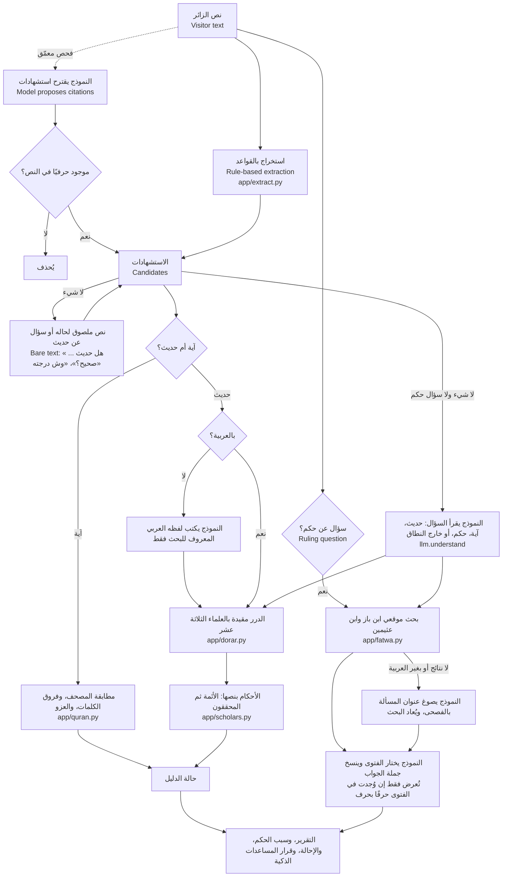

# البنية · Architecture

طوّرنا تثبّت وبرمجناه في فريق «قيد الأوابد»، مستعينين بـ Claude Code في كتابة الكود (الإفصاح في [SOURCES_AND_LICENSES.md](../SOURCES_AND_LICENSES.md) و[team.md](team.md)). هذا الملف يصف النظام كما يعمل على الموقع المباشر في 5 أكتوبر 2026.

## الأقسام والواجهات · Surfaces

| القسم | المسار | ما يستدعيه |
|---|---|---|
| الفحص | `/` | `POST /api/check` |
| اسأل الثقات (الأسئلة وإجابات المساعدات الذكية) | `/static/chatbot.html` | `POST /api/check`، والقرار `decision` |
| الأرشيف | `/static/archive.html` | `GET /api/archive` (`data/archive.json`) |
| أركان الإسلام | `/static/pillars.html` | `GET /api/pillars` (آيات المصحف وترجماتها)، وكلام ابن باز من `data/pillars_sources.json` |
| للمطورين | `/docs`، `/mcp` | الواجهة البرمجية، وخادم MCP (`app/mcp_server.py`) |
| الحالة | `/api/health` | الإصدار، والدرر، والنموذجان وآخر خطأ لكل منهما |

## مسار الفحص · Request flow

## المبدأ الحاكم · Governing rule

| ما تفعله الأداة | ما لا تفعله |
|---|---|
| تستخرج الاستشهاد وتبحث عنه وتطابقه | لا تحكم على حديث، ولا تشرح علّة تضعيفه أو تصحيحه |
| تنقل نص المصحف من ملف موثّق | لا تولّد نص القرآن أبدًا: حتى الآية التي يكتبها النموذج من سؤال الزائر لا تُعرض إلا إن وُجدت في المصحف، ويُعرض نص المصحف لا نصه |
| تنقل أحكام العلماء الثلاثة عشر بنصها مع قائلها | لا ترجّح بين العلماء ولا ترتّبهم حسب القوة |
| تجيب سؤال الحكم بجملة من فتوى ابن باز أو ابن عثيمين، منقولة بنصها ومتحقق منها حرفًا بحرف، وتقول إن كانت الفتوى في المسألة نفسها أو في مسألة قريبة | لا تفتي، ولا يكتب النموذج من الجواب حرفًا؛ فإن لم يجد جملة موجودة في الفتوى لم يُعرض جواب، وتُعرض الفتاوى والإحالة إلى جهة الإفتاء |
| تقول «لم نجد» وتحيل إلى المختص | لا تملأ الفراغ بتوليد |

## النموذجان ومهامهما · The two models and their jobs

| المهمة | من يجيب على الموقع | الحارس |
|---|---|---|
| استخراج الاستشهادات (الفحص المعمّق) | النموذج السريع، ثم علّام | كل اقتباس يجب أن يوجد حرفيًا في نص الزائر |
| اللفظ العربي لاقتباس مترجم | النموذج السريع، ثم علّام | يُستعمل للبحث فقط ولا يُعرض مصدرًا |
| اختيار الأصل العربي من نتائج الدرر | النموذج السريع، ثم علّام | يُرفض إن خالف الصياغة التي اقترحها النموذج نفسه |
| قراءة سؤال لم تعرفه القواعد | النموذج السريع، ثم علّام | يعطي كلمات بحث فقط؛ الجواب من المصادر |
| اختيار جملة الجواب من الفتوى | النموذج السريع، ثم علّام | تُعرض فقط إن وُجدت في الفتوى حرفًا بحرف |

النموذج السريع `openai/gpt-oss-120b` على Groq، وعلّام 7B على معالج الحاوية (`app/llm.py`). يُضبط التوزيع بـ `TATHABBUT_LLM_FALLBACK_FIRST`، ويذكر كل تقرير النموذج الذي أجاب (`model.answered_by`). وعند خطأ مؤقت محاولة ثانية، وعند رد فارغ سؤال بصياغة أبسط، ثم علّام، ثم الإحالة.

## حالة الدليل · Evidence tier

| الحالة | الشرط |
|---|---|
| `documented` مطابق للمصحف | آية مطابقة للمصحف، وليس فيها عزو خطأ ولا مطابقة بالنموذج |
| `supported` تؤيده المصادر | حديث في الصحيحين، أو كل أحكام المعتمدين على لفظه في المقبول (`data/display_rules.json`) |
| `not_supported` لا تؤيده المصادر المعتمدة | كل أحكام المعتمدين على لفظه ضعيف أو ضعيف جدًا أو موضوع |
| `verify` يحتاج مزيدًا من التحقق | لفظ مختلف، أو عزو خطأ، أو لفظ مقارب، أو نصوص أخرى تشبهه في بعض ألفاظه فقط (`loose_only`)، أو اختلاف الأحكام، أو مطابقة اقترحها النموذج |
| `refer` يُحال إلى مختص | لم يوجد في المصدر، أو سؤال فتوى شخصية |

**الصحيحان أولًا**، بحسب اسم الكتاب لا اسم المحدّث، موافقةً لمنهج الدرر في التخريج ([dorar.net/article/77](https://dorar.net/article/77)) وتنبيهها في السؤال 13 من [dorar.net/feedback](https://dorar.net/feedback).

## الوحدات · Modules

| الملف | المسؤولية | يُختبر في |
|---|---|---|
| `app/normalize.py`، `app/spelling.py` | تطبيع العربية، والهيكل الحرفي، وفهرس الإملاء الشائع | `tests/test_normalize_quran.py`، `tests/test_quran_spelling.py` |
| `app/quran.py` | مطابقة المصحف، وفروق الكلمات، والعزو، وترجمات المعاني الإحدى عشرة | `tests/test_normalize_quran.py` |
| `app/extract.py` | الأقواس، وعبارات الإسناد، والمراجع بأقواس وبدونها («سورة آل عمران آية 10»)، والآيات غير المعلّمة | `tests/test_extract.py` |
| `app/dorar.py`، `app/scholars.py` | الدرر بمعرّفات العلماء، والتخزين المؤقت، والفاصل بين الطلبات؛ العلماء ومجموعتاهم | `tests/test_pipeline.py` |
| `app/fatwa.py` | بحث موقعي الشيخين وترتيب النتائج بتقارب الألفاظ | `tests/test_pipeline.py` |
| `app/llm.py` | النموذجان، والمخططات، والمحاولات، وسجل الحالة | `tests/test_mcp.py`، `tests/test_pipeline.py` |
| `app/pipeline.py` | الفحص، والعامية، وجواب الفتوى، وحالة الدليل، وقرار المساعدات الذكية | `tests/test_pipeline.py` |
| `app/mcp_server.py` | أدوات MCP الثلاث | `tests/test_mcp.py` |
| `app/main.py` | FastAPI، وحد الطلبات لكل زائر، و`/api/pillars` و`/api/archive` | `tests/test_pillars.py` |
| `static/` | الواجهة بإحدى عشرة لغة وفق [نظام التصميم](design-system.md)، والرسوم المتحركة (`figures.js`) | لقطات Playwright، و`scripts/persona_check.py` على الموقع المباشر |

## الخصوصية · Privacy

لا يُخزَّن نص الزائر على الخادم ولا يُسجَّل. سجل الزائر في متصفحه وحده، ولا تسجيل دخول. ويُرسل إلى الدرر لفظ الحديث وحده، وإلى موقعي الشيخين كلمات موضوع السؤال وحدها، وإلى النموذج ما تحتاجه مهمته فقط ([api-and-keys.md](api-and-keys.md)).
