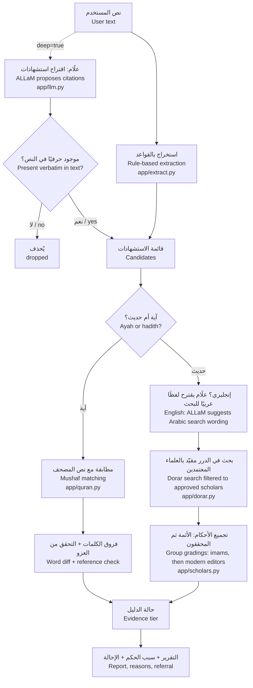

# البنية · Architecture

## مسار الفحص · Request flow

## المبدأ الحاكم · Governing rule

| ما تفعله الأداة | ما لا تفعله |
|---|---|
| تستخرج الاستشهاد وتبحث عنه وتطابقه | لا تحكم على حديث، ولا تشرح علّة تضعيفه أو تصحيحه |
| تنقل نص المصحف من ملف موثّق | لا تولّد نص القرآن أبدًا، ولا تصحح الآية من النموذج |
| تنقل أحكام العلماء المعتمدين بنصها مع قائلها | لا ترجّح بين العلماء ولا ترتّبهم حسب القوة |
| تقول «لم نجد» وتحيل إلى المختص | لا تفتي، وأسئلة الفتوى الشخصية تُحال إلى جهة الإفتاء |

الحكم في الحديث للعلماء، و«سبب الحكم» في الحديث يصف البحث فقط (أين بحثنا، بأي لفظ، كم حكمًا وجدنا).

**الصحيحان أولًا.** إذا وُجد اللفظ بتقارب قوي في نتيجة مصدرها «صحيح البخاري» أو «صحيح مسلم» ذُكر ذلك في أول الأحكام. وهذا موافق لمنهج الدرر في التخريج: «إذا كان الحديثُ في صَحيحيِ البُخاريِّ ومُسلِمٍ - أو أحدِهما - يُكتفَى بتَخريجِه منهما فقط» ([dorar.net/article/77](https://dorar.net/article/77)). ويُحكم بذلك من اسم الكتاب لا من اسم المحدّث، لأن الدرر تنبه: «عليك التأكد من المصدر هل هو في صحيح البخاري أم لا، فالأحاديث التي رواها البخاري في غير صحيحه ليست كلها صحيحة» (السؤال 13 في [dorar.net/feedback](https://dorar.net/feedback)). وهي قراءة الأداة لبيانات الدرر، لا وسم تضعه الدرر.

## حالة الدليل · Evidence tier

معيار نجاح المسار الرابع يطلب التمييز بين ما تدعمه المصادر وما يحتاج تحققًا أو إحالة، فلكل استشهاد حالة واحدة (`app/pipeline.py: evidence_tier`):

| الحالة | الشرط |
|---|---|
| `documented` موثّق المصدر | آية مطابقة للمصحف، أو حديث وُجدت له أحكام معتمدة، وليس فيه عزو خطأ ولا مطابقة بالنموذج |
| `verify` يحتاج مزيدًا من التحقق | لفظ مختلف، أو عزو خطأ، أو لفظ مقارب، أو مطابقة اقترحها النموذج |
| `refer` يُحال إلى مختص | لم يوجد في المصدر، أو سؤال فتوى شخصية |

## الوحدات · Modules

| الملف | المسؤولية | يُختبر في |
|---|---|---|
| `app/normalize.py` | تطبيع العربية والهيكل الحرفي (حذف التشكيل والألف والهمزة) | `tests/test_normalize_quran.py` |
| `app/quran.py` | مطابقة تامة بالبحث في نص المصحف كاملًا، ومطابقة تقريبية بنوافذ آيات متتالية، وفروق الكلمات، والعزو | `tests/test_normalize_quran.py` |
| `app/extract.py` | الأقواس القرآنية، وعبارات الإسناد (قال ﷺ، قال تعالى)، والمراجع المكتوبة، والآيات غير المعلّمة | `tests/test_extract.py` |
| `app/dorar.py` | البحث في الدرر بمعرّفات العلماء، والتخزين المؤقت، والفاصل الزمني بين الطلبات، والبديل الاحتياطي | `tests/test_pipeline.py` |
| `app/scholars.py` | قائمة العلماء المعتمدين ومجموعتاهم، وقاعدة كلام الجرح والتعديل، وعلامة الوضع | `tests/test_pipeline.py` |
| `app/llm.py` | طبقة نموذج قابلة للتبديل: llama.cpp أو خادم متوافق مع OpenAI أو بدون نموذج | `tests/test_pipeline.py` (نموذج وهمي) |
| `app/pipeline.py` | تنسيق الفحص، والحالات، والإحالة، والملخص | `tests/test_pipeline.py` |
| `app/main.py` | FastAPI: `/api/check` و`/api/health` و`/api/sources`، وحد الطلبات | — |
| `static/` | الواجهة العربية والإنجليزية وفق [نظام التصميم](design-system.md) | لقطات Playwright |

## الخصوصية · Privacy

النص الكامل لا يُخزَّن. الذي يُرسل إلى الدرر هو لفظ الحديث المستخرج فقط. وعند الاستعانة بعلّام يُرسل النص إلى النموذج على خادم الفريق (نقطة Hugging Face مخصصة للفريق، انظر [operations.md](operations.md))، ولا يُرسل إلى غيره.
